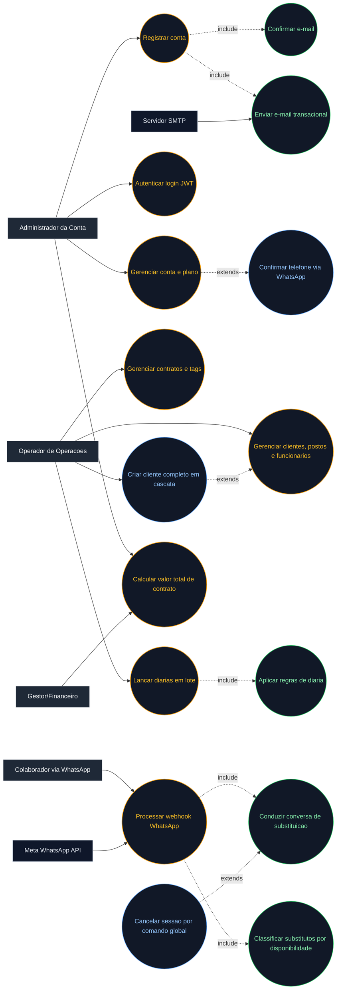

# UML - Diagrama de Caso de Uso

Diagrama de caso de uso do **InterceptorSystem** baseado no README: autenticacao SaaS, operacoes de seguranca patrimonial e fluxo conversacional de substituicao via WhatsApp.

## Escopo do diagrama

- **Autenticacao e SaaS**: registro, login, verificacao de e-mail, gestao de conta/plano e telefone.
- **Operacoes core**: clientes, funcionarios, postos, contratos, tags, diarias e criacao em cascata.
- **Financeiro**: calculo de contrato por endpoint dedicado.
- **WhatsApp bot**: webhook, estado de conversa e ranking de substitutos.
