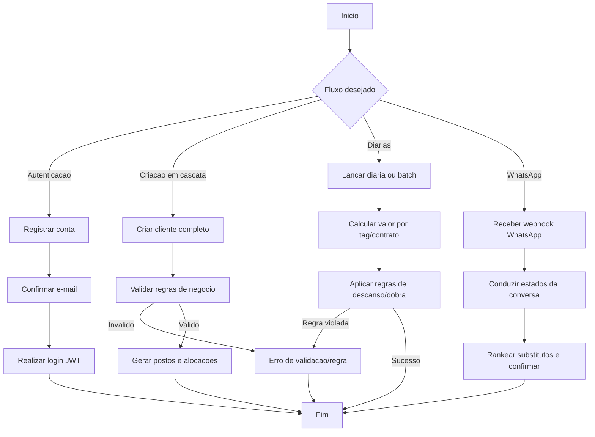

# UML - Cenarios de Uso

Documento de cenarios principais do InterceptorSystem com foco em fluxos de maior valor do README: autenticacao SaaS, operacao diaria, criacao em cascata e WhatsApp.

## Cenario 1 - Registrar conta, confirmar e-mail e autenticar

- `Ator principal`: Administrador da Conta
- `Objetivo`: criar tenant e obter acesso autenticado ao sistema
- `Pre-condicoes`: e-mail ainda nao cadastrado
- `Gatilho`: envio de `POST /api/auth/registrar`

### Fluxo principal

1. Usuario envia dados de cadastro.
2. API cria conta SaaS (`Conta.Id = EmpresaId`) e token de verificacao.
3. Sistema envia e-mail transacional de confirmacao.
4. Usuario confirma o e-mail em `POST /api/auth/email/confirmar`.
5. Usuario autentica via `POST /api/auth/login` e recebe JWT.

### Fluxos alternativos

- `A1`: e-mail ja cadastrado -> API retorna conflito (409).
- `A2`: token expirado/invalido -> solicitacao de reenvio em `POST /api/auth/email/reenviar`.
- `A3`: senha invalida no login -> autenticacao negada.

### Pos-condicoes

- Conta ativa e validada.
- Sessao autenticada com JWT no frontend.

## Cenario 2 - Criacao em cascata de cliente completo

- `Ator principal`: Operador de Operacoes
- `Objetivo`: inicializar cliente com contrato, postos e alocacoes em um unico request
- `Pre-condicoes`: usuario autenticado e com tenant ativo
- `Gatilho`: envio de `POST /api/clientes-completos`

### Fluxo principal

1. Operador informa dados de cliente e contrato.
2. Sistema valida regras de negocio (ex.: CNPJ unico, contrato vigente).
3. Sistema cria cliente, contrato e postos.
4. Sistema gera alocacoes automaticas conforme quantidade solicitada.
5. API retorna sucesso com estrutura completa criada.

### Fluxos alternativos

- `A1`: CNPJ duplicado no tenant -> retorno 409.
- `A2`: contrato invalido (datas/estado) -> retorno 400.
- `A3`: falha de consistencia em criacao agregada -> transacao revertida.

### Pos-condicoes

- Base operacional inicial pronta para lancamento de diarias.

## Cenario 3 - Lancar diarias com validacao de regras

- `Ator principal`: Operador de Operacoes
- `Objetivo`: registrar diarias individuais ou em lote com regras de escala e descanso
- `Pre-condicoes`: funcionario, alocacao e contrato validos
- `Gatilho`: envio de `POST /api/diarias` ou `POST /api/diarias/batch`

### Fluxo principal

1. Operador envia dados de diaria (funcionario, data, tipo, alocacao).
2. Sistema calcula `ValorDiaria` por tag/contrato no momento da criacao (snapshot).
3. Sistema verifica restricoes de consecutividade e descanso pos-dobra.
4. Sistema persiste diaria e invalida cache relacionado via domain events.

### Fluxos alternativos

- `A1`: funcionario indisponivel/duplicado no mesmo dia -> rejeicao.
- `A2`: tentativa de diaria no dia seguinte a `DOBRA_PROGRAMADA` -> bloqueio com erro de negocio.
- `A3`: payload em lote com itens invalidos -> retorno com falhas de validacao.

### Pos-condicoes

- Diarias confirmadas para consulta nos modos diario/semanal/mensal do frontend.

## Cenario 4 - Substituicao de diaria via WhatsApp

- `Ator principal`: Colaborador com telefone verificado
- `Atores de apoio`: Meta WhatsApp API
- `Objetivo`: conduzir substituicao por conversa guiada
- `Pre-condicoes`: webhook configurado; telefone autorizado para a conta
- `Gatilho`: mensagem recebida em `POST /api/whatsapp/webhook`

### Fluxo principal

1. Meta envia evento para webhook.
2. Sistema localiza ou cria `SessaoWhatsapp`.
3. Bot percorre estados: cliente -> posto -> data -> substituido -> substituto -> confirmacao.
4. Sistema ranqueia substitutos por disponibilidade (ultimos 30 dias).
5. Sistema confirma a substituicao e encerra sessao.

### Fluxos alternativos

- `A1`: telefone nao autorizado -> mensagem de bloqueio.
- `A2`: comando `0`, `cancelar` ou `sair` -> sessao cancelada.
- `A3`: inatividade por 15 minutos -> sessao expirada e limpa em background.

### Pos-condicoes

- Substituicao registrada ou sessao encerrada com status consistente.

## Diagrama consolidado de cenarios

