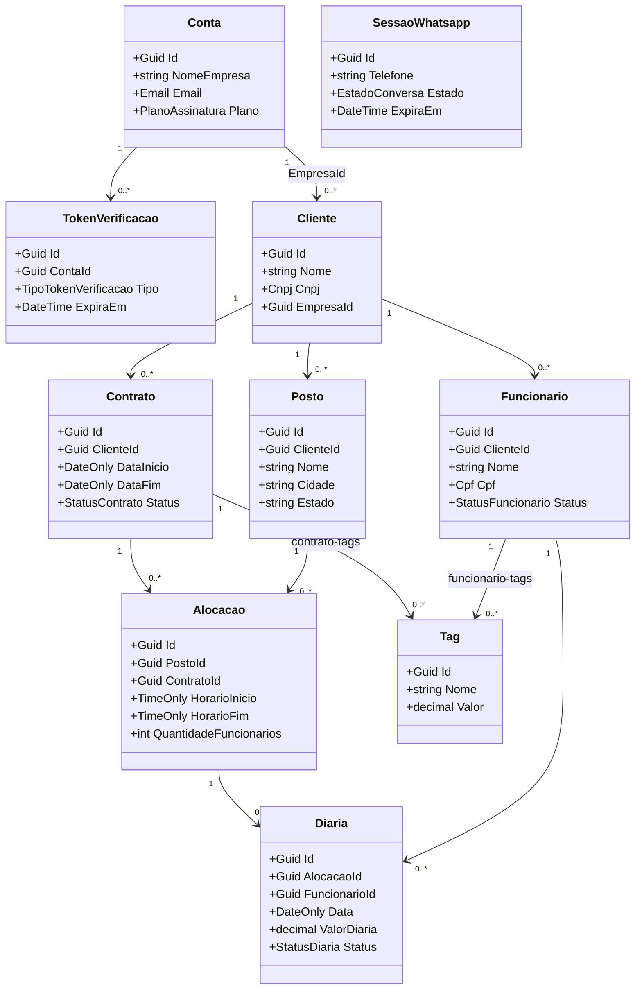

# UML - Diagrama de Classes

Diagrama de classes simplificado dos agregados principais dos 3 Bounded Contexts.

```mermaid
classDiagram
    class Conta {
      +Guid Id
      +string NomeEmpresa
      +Email Email
      +PlanoAssinatura Plano
    }

    class TokenVerificacao {
      +Guid Id
      +Guid ContaId
      +TipoTokenVerificacao Tipo
      +DateTime ExpiraEm
    }

    class Cliente {
      +Guid Id
      +string Nome
      +Cnpj Cnpj
      +Guid EmpresaId
    }

    class Contrato {
      +Guid Id
      +Guid ClienteId
      +DateOnly DataInicio
      +DateOnly DataFim
      +StatusContrato Status
    }

    class Posto {
      +Guid Id
      +Guid ClienteId
      +string Nome
      +string Cidade
      +string Estado
    }

    class Alocacao {
      +Guid Id
      +Guid PostoId
      +Guid ContratoId
      +TimeOnly HorarioInicio
      +TimeOnly HorarioFim
      +int QuantidadeFuncionarios
    }

    class Funcionario {
      +Guid Id
      +Guid ClienteId
      +string Nome
      +Cpf Cpf
      +StatusFuncionario Status
    }

    class Diaria {
      +Guid Id
      +Guid AlocacaoId
      +Guid FuncionarioId
      +DateOnly Data
      +decimal ValorDiaria
      +StatusDiaria Status
    }

    class Tag {
      +Guid Id
      +string Nome
      +decimal Valor
    }

    class SessaoWhatsapp {
      +Guid Id
      +string Telefone
      +EstadoConversa Estado
      +DateTime ExpiraEm
    }

    Conta "1" --> "0..*" TokenVerificacao
    Conta "1" --> "0..*" Cliente : EmpresaId

    Cliente "1" --> "0..*" Contrato
    Cliente "1" --> "0..*" Posto
    Cliente "1" --> "0..*" Funcionario

    Contrato "1" --> "0..*" Alocacao
    Posto "1" --> "0..*" Alocacao

    Alocacao "1" --> "0..*" Diaria
    Funcionario "1" --> "0..*" Diaria

    Contrato "1" --> "0..*" Tag : contrato-tags
    Funcionario "1" --> "0..*" Tag : funcionario-tags
```
