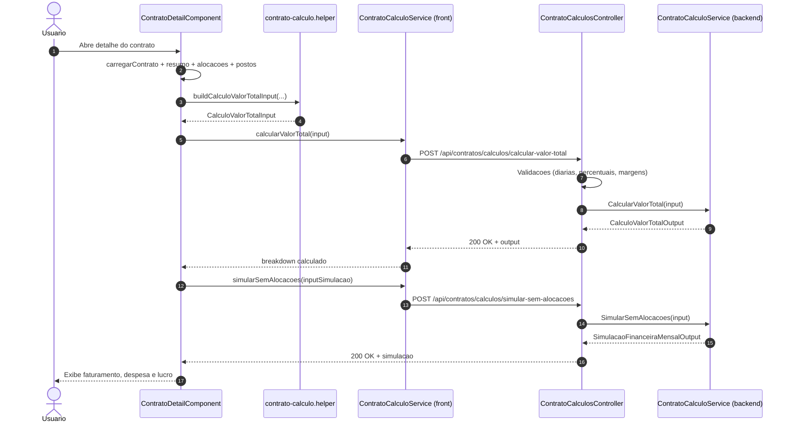
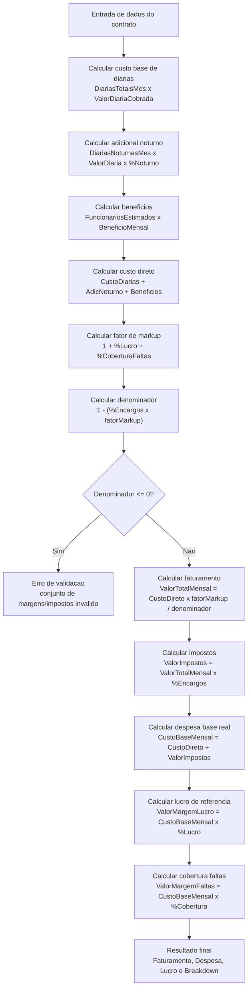
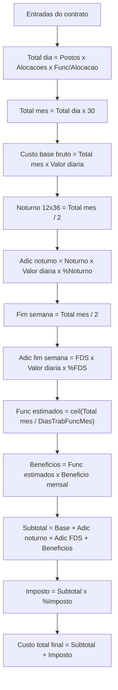

# UML - Fluxograma de Calculo Financeiro do Contrato

## Objetivo

Documentar o fluxo real de calculo de `despesa`, `faturamento` e `lucro` usado no backend (`ContratoCalculoService`) para facilitar analise e validacao funcional.

## Fluxo completo (front ate backend)

### Visao geral

1. Usuario abre a tela de detalhe do contrato.
2. Front carrega dados do contrato, alocacoes, postos e resumo de diarias.
3. Front monta `CalculoValorTotalInput` com helper compartilhado.
4. Front chama `POST /api/contratos/calculos/calcular-valor-total`.
5. Backend valida payload e delega para `ContratoCalculoService`.
6. Backend retorna breakdown completo (faturamento, custo, impostos, margens).
7. Front renderiza cards e relatorios (real e simulado).

### Sequencia tecnica (end-to-end)

### Onde cada parte do calculo nasce

- Front (`ContratoDetailComponent`):
  - coleta dados operacionais (diarias, noturnas, funcionarios estimados)
  - normaliza percentuais para evitar dupla conversao
  - monta payload final de calculo
- Backend (`ContratoCalculosController`):
  - valida limites e consistencia basica dos campos
- Backend (`ContratoCalculoService`):
  - executa formula oficial de faturamento, despesa base e margens
  - devolve breakdown unico para a tela

## Regras base do backend

1. `DiariasTotaisMes` considera base operacional (neste fluxo, dias uteis).
2. FDS e feriados sao tratados como risco/informacao (nao entram no `custoDireto`).
3. A formula de faturamento usa markup com encargos, lucro e cobertura de faltas.

## Fluxograma (visao de negocio)

## Cenario numerico (exemplo)

### Entrada

- Valor diaria cobrada: `R$100,00`
- Diarias totais do mes: `44`
- Diarias noturnas do mes: `0`
- Funcionarios estimados: `1`
- Beneficios por funcionario: `R$350,00`
- Encargos e provisoes: `40%` (`0,40`)
- Margem de lucro: `15%` (`0,15`)
- Cobertura de faltas: `10%` (`0,10`)

### Passo a passo

1. `Custo diarias = 44 x 100 = R$4.400,00`
2. `Adicional noturno = 0 x 100 x 0,20 = R$0,00`
3. `Beneficios = 1 x 350 = R$350,00`
4. `CustoDireto = 4.400 + 0 + 350 = R$4.750,00`
5. `FatorMarkup = 1 + 0,15 + 0,10 = 1,25`
6. `Denominador = 1 - (0,40 x 1,25) = 0,50`
7. `Faturamento = (4.750 x 1,25) / 0,50 = R$11.875,00`
8. `Impostos = 11.875 x 0,40 = R$4.750,00`
9. `Despesa base (custo real) = 4.750 + 4.750 = R$9.500,00`
10. `Lucro referencia = 9.500 x 0,15 = R$1.425,00`
11. `Cobertura faltas = 9.500 x 0,10 = R$950,00`

## Armadilhas comuns (causa de divergencia)

1. **Dupla conversao de percentual**: enviar `0,15` como `0,0015` (dividir por 100 duas vezes).
2. **Mistura de unidades**: usar alguns campos em `%` (15) e outros em decimal (`0,15`) sem normalizacao.
3. **Comparar lucro por formulas diferentes**: `faturamento - custoBase` vs `margem x custoBase` sao metricas relacionadas, mas nao identicas em todos os contextos de exibicao.

## Cenario alternativo (logica solicitada)

Esta secao descreve exatamente a logica que voce pediu, em formato operacional.

### Entradas do cenario

- `postos`
- `alocacoesPorPosto`
- `funcionariosPorAlocacao`
- `valorDiariaBase`
- `percentualAdicionalNoturno`
- `percentualAdicionalFimSemana`
- `diasMes` (neste cenario: `30`)
- `diasTrabalhadosPorFuncionarioMes` (para estimativa de beneficios)
- `valorBeneficioMensalPorFuncionario`
- `percentualImposto`

### Formula passo a passo

1. Total de diarias por dia:

   `totalDiariasDia = postos x alocacoesPorPosto x funcionariosPorAlocacao`

2. Total de diarias no mes:

   `totalDiariasMes = totalDiariasDia x diasMes`

3. Custo base bruto de diarias:

   `custoBaseBruto = totalDiariasMes x valorDiariaBase`

4. Adicional noturno (regra 12x36 = metade):

   `diariasNoturnasMes = totalDiariasMes / 2`

   `valorAdicionalNoturno = diariasNoturnasMes x valorDiariaBase x percentualAdicionalNoturno`

5. Adicional de fim de semana (mesma logica de metade, conforme solicitado):

   `diariasFimSemanaMes = totalDiariasMes * 8/30`

   `valorAdicionalFimSemana = diariasFimSemanaMes x valorDiariaBase x percentualAdicionalFimSemana`

6. Funcionarios estimados para beneficios:

   `funcionariosEstimados = ceil(totalDiariasMes / diasTrabalhadosPorFuncionarioMes)`

   `valorBeneficios = funcionariosEstimados x valorBeneficioMensalPorFuncionario`

7. Subtotal antes de imposto:

   `subtotalSemImposto = custoBaseBruto + valorAdicionalNoturno + valorAdicionalFimSemana + valorBeneficios`

8. Imposto:

   `valorImposto = subtotalSemImposto x percentualImposto`

9. Custo total final:

   `custoTotalFinal = subtotalSemImposto + valorImposto`

### Fluxograma do cenario solicitado

## Analise do Cenario Simulado (Dump do Front-end)

O relatorio simulado fornecido contem erros matematicos que estouram a metrica de "Funcionarios Necessarios", afetando os beneficios. Abaixo esta detalhado o fluxo com os acertos necessarios.

### Origem do Bug no Simulador (Relatorio do Usuario)

1. **A Projecao "44 ÷ 2 = 22 funcionarios" esta conceitualmente invertida:**
   Se uma operacao precisa de **2 postos de trabalho (diarias) ocorrendo simultaneamente num mesmo dia** ao longo de 22 dias no mes, a demanda exige exatamente **2 funcionarios** que vao trabalhar esses 22 dias. O front-end dividiu os _dias do mes trabalhados_ pela _demanda diaria_, chegando a 22, o que nao faz sentido. Escalas normais demandam 1 pessoa por posto diario.
2. **Custo de Beneficios "22 func \* 350 = 0" estourou a variavel:**
   Alem das projecoes de 22 pessoas serem falsas, a matematica zerou. O certo seria basear nos 2 funcionarios aferidos.
3. **Trava no Tipo de Posto (Sempre 1 funcionário 12/36):**
   Qualquer tipo de posto selecionado é ignorado, deixando a configuração travada em "1 funcionário 12/36". Isso corrompe os cálculos para outras escalas (ex: 5x2, 8h).

### O Fluxo de Dados Consertado (Step-by-Step)

**Etapa 1: Operacao Base**

- **Demanda Diaria/Dia:** 1 posto x 2 aloc/posto x 1 func/aloc = **2**
- **Funcionarios Necessarios (Headcount):** = Demanda Diaria (**2 funcionarios**, assumindo trabalho de seg-sex para cobrir dias uteis).
- **Volumetrias do Mes (para base de R$ 100,00):**
  - Uteis (22 dias): 44 diarias (22 x 2)
  - Finais de Semana (8 dias): 16 diarias (8 x 2)

**Etapa 2: A Carga Financeira Correta (Custos Diretos Mensais)**

- **Diarias Normais:** 44 x R$ 100,00 = **R$ 4.400,00**
- **Diarias FDS:** 16 x R$ 100,00 = **R$ 1.600,00**
- _(Nota: O Adicional Noturno de dump R$ 1.240,00 significa que o front previu ~31 dias estourando 20% de adicional em cima de diarias cheias de 100 reais, mantendo conforme regra original)._
- **Adicional Noturno:** **R$ 1.240,00**
- **Beneficios Reais:** 2 funcionarios (Headcount correto) x R$ 350,00 = **R$ 700,00** (Resolve o problema do R$ 0,00)

- **Novo Total Consolidado (Custo Subtotal):**
  `R$ 4.400 (Base) + 1.600 (FDS) + 1.240 (Noturno) + 700 (Beneficios)` = **R$ 7.940,00**

**Etapa 3: Resultado Simulado (Pre-Markup)**
Este e o valor que as rotinas do controlador vao absorver... (O total de **R$ 7.940,00** vai para a base do fator Markup).
