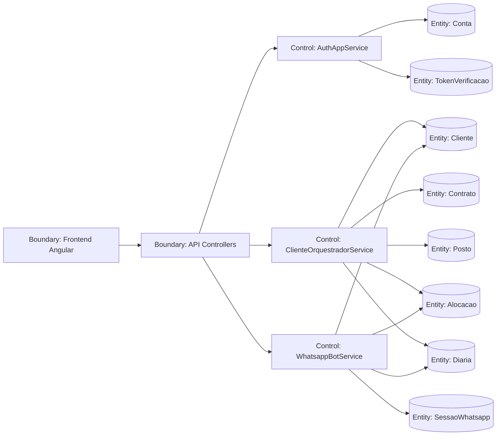

# UML - Diagrama de Robustez

Robustez do fluxo de autenticacao e operacao, modelando Boundary, Control e Entity.

```mermaid
flowchart LR
    UI[Boundary: Frontend Angular]
    API[Boundary: API Controllers]

    AC[Control: AuthAppService]
    OC[Control: ClienteOrquestradorService]
    WC[Control: WhatsappBotService]

    E1[(Entity: Conta)]
    E2[(Entity: TokenVerificacao)]
    E3[(Entity: Cliente)]
    E4[(Entity: Contrato)]
    E5[(Entity: Posto)]
    E6[(Entity: Alocacao)]
    E7[(Entity: Diaria)]
    E8[(Entity: SessaoWhatsapp)]

    UI --> API
    API --> AC
    API --> OC
    API --> WC

    AC --> E1
    AC --> E2

    OC --> E3
    OC --> E4
    OC --> E5
    OC --> E6
    OC --> E7

    WC --> E8
    WC --> E3
    WC --> E6
    WC --> E7
```
