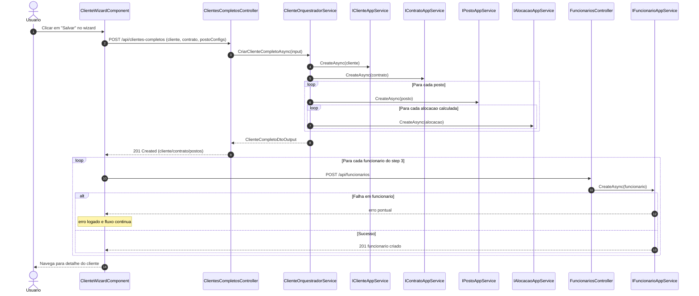
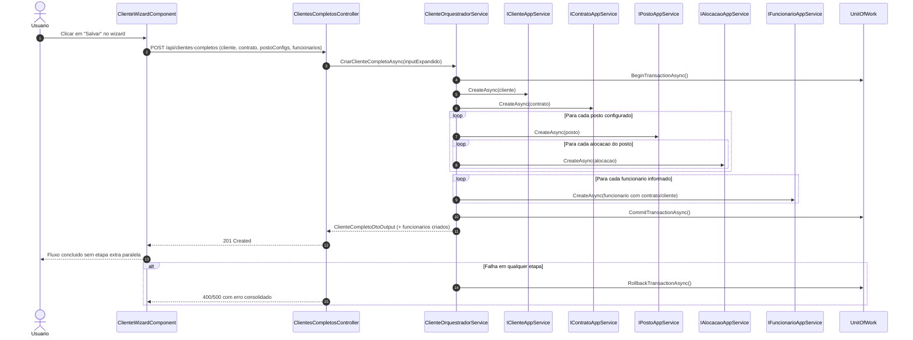

# UML - Sequencia de Criacao Completa em Cascata (Wizard)

## Contexto do problema

No fluxo atual, o wizard cria `cliente + contrato + postos + alocacoes` no endpoint `POST /api/clientes-completos`, mas os funcionarios sao criados depois, em chamadas separadas para `POST /api/funcionarios`.

Consequencias:

- Nao existe atomicidade fim-a-fim do processo de criacao completa.
- Pode haver sucesso parcial (cliente/contrato/postos/alocacoes criados e parte dos funcionarios com falha).
- Nao existe vinculo explicito entre funcionario e alocacao no payload do wizard.

## Sequencia AS-IS (comportamento atual)

## Sequencia TO-BE (proposta de correcao)

## Plano de resolucao (incremental)

### Fase 1 - Correcao de atomicidade (prioritaria)

1. Expandir `CreateClienteCompletoDtoInput` com `Funcionarios` (lista opcional).
2. Atualizar `cliente-wizard.component.ts` para enviar funcionarios no mesmo payload do endpoint orquestrado.
3. Mover criacao de funcionarios para `ClienteOrquestradorService` dentro da mesma transacao ja existente.
4. Retornar no output os funcionarios criados (ou contagem/ids), eliminando chamadas sequenciais separadas no frontend.

### Fase 2 - Regras de consistencia

1. Validar coerencia entre quantidade de funcionarios informados e capacidade de alocacoes por posto.
2. Definir estrategia de distribuicao de funcionarios por escala (ex.: round-robin por tipo de escala).
3. Garantir mensagens de erro funcionais (ex.: "funcionarios insuficientes para escala X").

### Fase 3 - Vinculo funcionario x alocacao (se exigido pela regra de negocio)

1. Evoluir modelo para registrar atribuicao explicita funcionario-alocacao (nova entidade/tabela de associacao).
2. Expandir payload e resposta para refletir atribuicoes.
3. Cobrir consultas operacionais e dashboards com o novo vinculo.

## Critérios de aceite da correcao

- O wizard conclui criacao de cliente, contrato, postos, alocacoes e funcionarios em uma unica chamada.
- Nao existe sucesso parcial silencioso de funcionarios.
- Em caso de falha, a transacao e revertida integralmente.
- Testes de integracao cobrem sucesso completo e rollback quando falha na criacao de funcionario.
