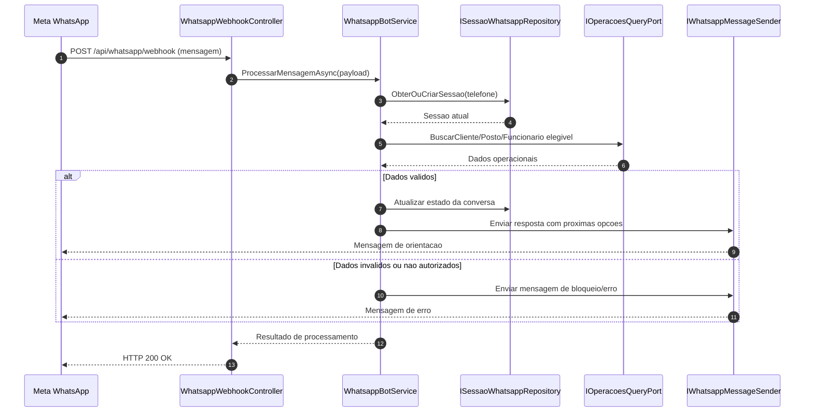

# UML - Diagrama de Sequencia

Sequencia descrita em texto (principal), com diagrama Mermaid de apoio.

## Sequencia textual - Fluxo webhook WhatsApp

### Participantes

- `Meta WhatsApp` (origem do evento)
- `WhatsappWebhookController` (entrada HTTP)
- `WhatsappBotService` (orquestracao)
- `ISessaoWhatsappRepository` (estado da conversa)
- `IOperacoesQueryPort` (consulta operacional)
- `IWhatsappMessageSender` (saida de mensagem)

### Passo a passo (fluxo principal)

1. Meta envia `POST /api/whatsapp/webhook` para a API.
2. Controller recebe payload e encaminha para o `WhatsappBotService`.
3. Bot busca (ou cria) a sessao da conversa pelo telefone.
4. Bot consulta dados operacionais necessarios para o estado atual.
5. Bot decide a proxima acao do fluxo.
6. Bot atualiza estado da sessao.
7. Bot envia resposta para o usuario via `IWhatsappMessageSender`.
8. Controller retorna `HTTP 200 OK` para Meta.

### Fluxos alternativos

- `F1`: telefone nao autorizado -> bot envia mensagem de bloqueio.
- `F2`: dados insuficientes -> bot envia resposta de orientacao e mantem estado.
- `F3`: erro de processamento interno -> controller ainda responde `200` para evitar reentrega em loop, com registro de erro interno.

## Diagrama de apoio

