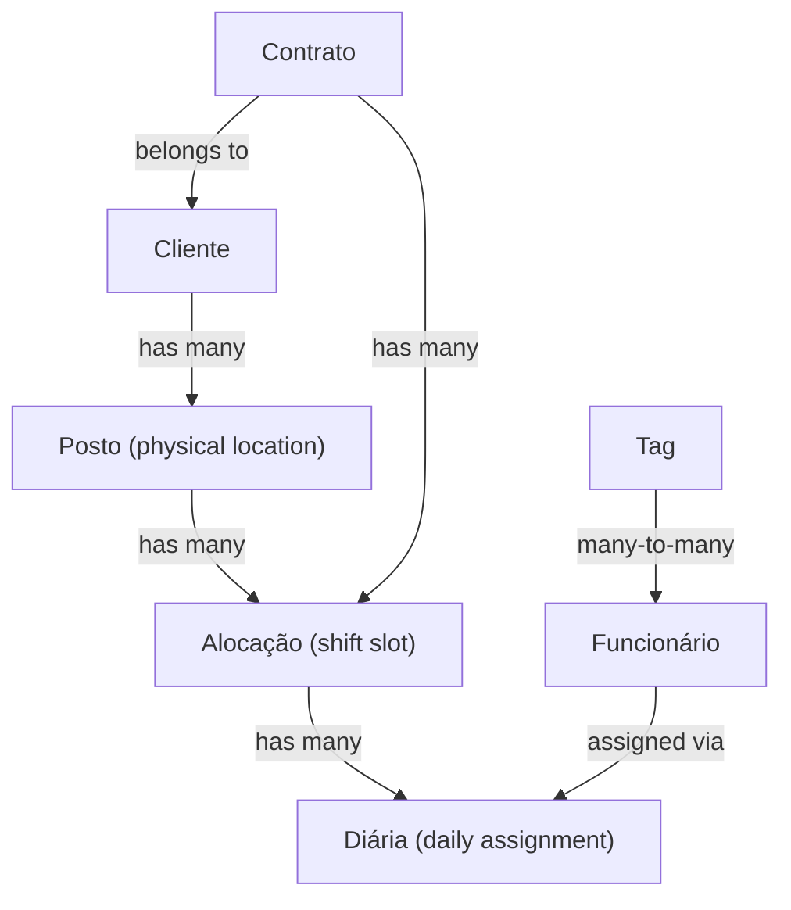

# InterceptorSystem — Domain Refactoring Implementation Plan


Full refactoring plan for backend (.NET Clean Architecture) and frontend (Angular 21), organized in **6 phases** ordered by dependency.

## New Domain Model



| Old Name | New Name | What It Represents |
|----------|----------|-------------------|
| `Condomínio` | **Cliente** | The client company (name + city + state) |
| `PostoDeTrabalho` | **Posto** | Physical location under a Client (city/state default from Cliente, overridable) |
| _(shift part of PostoDeTrabalho)_ | **Alocação** | Shift slot at a Posto (HorarioInicio/Fim, TipoEscala, ContratoId) |
| `Alocação` (old) | **Diária** | Daily employee assignment with `ValorDiaria` |

> [!IMPORTANT]
> This is a structural split: the old `PostoDeTrabalho` entity **splits** into `Posto` (location) + `Alocação` (time slot). The old `Alocação` entity is **renamed** to `Diária`.

## Decisions Log

| Question | Decision |
|----------|----------|
| Phase 2 — API breaking change | **Clean break** — no deprecation period |
| Phase 4 — Financial model | **Full replacement** — old contract-based salary division removed |
| Landing page text | Replace with **"associação condominial"** |

---

## Phase 1 — Flexible Shifts & Schedules

**Goal**: Remove the strict 12h-only shift validation and support Alcalá 8h, commercial, and Folguista schedules.

### Domain Layer

#### [MODIFY] [TipoEscala.cs](file:///home/jpcalsavara/projetos/andamento/InterceptorSystem/backend/src/InterceptorSystem.Domain/Modulos/Administrativo/Enums/TipoEscala.cs)

```diff
 public enum TipoEscala
 {
     DOZE_POR_TRINTA_SEIS = 0,
-    SEMANAL_COMERCIAL = 1
+    SEMANAL_COMERCIAL = 1,
+    ALCALA_8H = 2,
+    FOLGUISTA = 3
 }
```

#### [MODIFY] [Posto.cs](file:///home/jpcalsavara/projetos/andamento/InterceptorSystem/backend/src/InterceptorSystem.Domain/Modulos/Administrativo/Entidades/Posto.cs)

- **Remove** 12h duration checks (lines 112, 129).
- **Replace** with 4h–12h range validation.
- **Add** `TipoEscala` property.

### Application / Infrastructure / Frontend

- Add `TipoEscala` to DTOs, EF configuration, models, and forms.
- Update posto-form dropdown and posto-list display.
- New migration: `AddTipoEscalaToPosto`.

### Tests

- Update `PostoAppServiceTests.cs` — remove 12h expectation, add 8h and commercial tests.

---

## Phase 2 — Entity Renames & Structural Split

**Goal**: Rename `Cliente → Cliente`, split `Posto → Posto + Diária`, rename `Diária → Diária`. Clean API break.

### 2A. Cliente → Cliente

**Cliente** is simplified to: `Nome`, `Cidade`, `Estado` (remove `Cnpj`, `Endereco`, `QuantidadeIdealPorTurno`, `HorarioTrocaTurno`).

#### Backend Renames

| Current File | New File |
|---|---|
| `Cliente.cs` | `Cliente.cs` |
| `ClienteId` (all FKs) | `ClienteId` |
| `IClienteRepository` → `IClienteRepository` | |
| `ClienteRepository` → `ClienteRepository` | |
| `ClienteAppService` → `ClienteAppService` | |
| `ClienteOrquestradorService` → `ClienteOrquestradorService` | |
| `ClienteDto` → `ClienteDto` | |
| `ClienteController` → `ClienteController` (route: `api/clientes`) | |
| All Events → `ClienteCreated/Updated/DeletedEvent` | |
| `ClienteCacheInvalidationHandler` → `ClienteCacheInvalidationHandler` | |
| `ClienteConfiguration` → `ClienteConfiguration` | |

#### [MODIFY] Cliente entity (was Cliente.cs)

```csharp
public class Cliente : Entity, IAggregateRoot
{
    public string Nome { get; private set; } = null!;
    public string Cidade { get; private set; } = null!;
    public string Estado { get; private set; } = null!;  // UF, e.g. "SP"
    public bool Ativo { get; private set; }
    public string? EmailGestor { get; private set; }
    public string? TelefoneEmergencia { get; private set; }

    public ICollection<Posto> Postos { get; private set; } = new List<Posto>();
    public ICollection<Funcionario> Funcionarios { get; private set; }  // non-TERCEIRIZADO employees
    public ICollection<Contrato> Contratos { get; private set; }
}
```

> [!IMPORTANT]
> **Funcionário ownership rule**: `ClienteId` is **nullable**. Non-TERCEIRIZADO employees belong to a Cliente (cascade delete). TERCEIRIZADO employees have `ClienteId = null` and belong only to the Empresa (tenant).
```

> [!NOTE]
> Removed: `Cnpj`, `Endereco`, `QuantidadeIdealPorTurno`, `HorarioTrocaTurno`. Address details now live on `Posto`.

#### Frontend Renames

| Current | New |
|---|---|
| `features/clientes/` | `features/clientes/` |
| `cliente-*.component.*` | `cliente-*.component.*` |
| `cliente.service.ts` | `cliente.service.ts` |
| Route `/clientes` | Route `/clientes` |
| Sidebar `'Clientes'` | `'Clientes'` |
| `models/index.ts` interfaces `Cliente` | `Cliente` |

---

### 2B. Posto → Posto (physical location)

**Posto** becomes a physical place: `Nome`, `Endereco`, `Cidade`, `Estado`. It belongs to a `Cliente` and has many `Diárias` (shift slots).

#### [MODIFY] Posto.cs → [NEW] Posto.cs

City and state are **required** — when creating a Posto, the frontend pre-fills them from the parent `Cliente`. The user can change them if the Posto is in a different city.

```csharp
public class Posto : Entity, IAggregateRoot
{
    public Guid ClienteId { get; private set; }
    public string Nome { get; private set; } = null!;       // "Porto Feliz - Portaria A"
    public string Endereco { get; private set; } = null!;    // full street address
    public string Cidade { get; private set; } = null!;      // pre-filled from Cliente, editable
    public string Estado { get; private set; } = null!;      // pre-filled from Cliente, editable
    public bool Ativo { get; private set; }

    public Cliente? Cliente { get; private set; }
    public ICollection<Diaria> Diarias { get; private set; } = new List<Diaria>();
}
```

> [!NOTE]
> Scheduling properties (`HorarioInicio`, `HorarioFim`, `TipoEscala`, `PermiteDobrarEscala`, `TemHorarioNoturno`) move to the new `Diária` entity.

#### Backend Renames

| Current | New |
|---|---|
| `Posto.cs` | `Posto.cs` |
| `PostoId` (FKs) | `PostoId` |
| `IPostoRepository` | `IPostoRepository` |
| `PostoRepository` | `PostoRepository` |
| `PostoAppService` | `PostoAppService` |
| `PostoDto` | `PostoDto` |
| `PostoConfiguration` | `PostoConfiguration` |
| Controller route `api/postos` | `api/postos` |

#### Frontend Renames

| Current | New |
|---|---|
| `features/postos/` | Keep `features/postos/` |
| `posto.service.ts` | `posto.service.ts` |
| Models `Posto` | `Posto` |

---

### 2C. New Alocação Entity (shift slot, inherits old Posto's scheduling)

**Alocação** = a shift slot at a `Posto`. Contains the scheduling logic that was on the old `PostoDeTrabalho`.

#### [NEW] Alocacao.cs (replaces old PostoDeTrabalho's scheduling role) ✅ DONE

```csharp
public class Alocacao : Entity, IAggregateRoot
{
    public Guid PostoId { get; private set; }
    public Guid ContratoId { get; private set; }
    public TimeSpan HorarioInicio { get; private set; }
    public TimeSpan HorarioFim { get; private set; }
    public TipoEscala TipoEscala { get; private set; }
    public bool PermiteDobrarEscala { get; private set; }

    [NotMapped]
    public bool TemHorarioNoturno { get; }  // same CLT logic

    public Posto? Posto { get; private set; }
    public Contrato? Contrato { get; private set; }
    public ICollection<Diaria> Diarias { get; private set; } = new List<Diaria>();
}
```

#### New CRUD stack ✅ DONE

- `AlocacaoDto.cs`, `IAlocacaoAppService.cs`, `AlocacaoAppService.cs`
- `AlocacaoController.cs` (route: `api/alocacao`)
- `IAlocacaoRepository.cs`, `AlocacaoRepository.cs`, `AlocacaoConfiguration.cs`

#### Frontend ✅ DONE

- `features/alocacoes/` — alocacao-list component.
- `services/alocacao.service.ts`

---

### 2D. Diária (daily employee assignment)

**Diária** = a single day's assignment of an employee to an **Alocação** (shift slot), with a `ValorDiaria` snapshot.

#### [MODIFY] Diaria.cs ✅ DONE

```csharp
public class Diaria : Entity, IAggregateRoot
{
    public Guid FuncionarioId { get; private set; }
    public Guid AlocacaoId { get; private set; }      // links to the shift slot (Alocação)
    public DateOnly Data { get; private set; }
    public decimal ValorDiaria { get; private set; }   // snapshot from Tag
    public StatusDiaria StatusDiaria { get; private set; }
    public TipoDiaria TipoDiaria { get; private set; }

    public Funcionario? Funcionario { get; private set; }
    public Alocacao? Alocacao { get; private set; }
}
```

#### Enum Renames

| Current | New |
|---|---|
| `StatusDiaria` | `StatusDiaria` |
| `TipoDiaria` | `TipoDiaria` |

#### Backend Renames

| Current | New |
|---|---|
| `Diaria.cs` | `Diaria.cs` |
| `DiariaDto` | `DiariaDto` |
| `DiariaAppService` | `DiariaAppService` |
| `DiariaController` | `DiariaController` (route: `api/diarias`) |
| `DiariaRepository` | `DiariaRepository` |
| `DiariaConfiguration` | `DiariaConfiguration` |
| `DiariaBatchAppService` | `DiariaBatchAppService` |

#### Frontend

- New `features/diarias/` module (rename from `features/diarias/` content).
- `diaria.service.ts`, route `/diarias`.

---

### 2E. Cascade Deletes & EF Core Migration

All relationships use **cascade delete**:

```
Cliente (delete) → Postos → Alocações → Diárias
Cliente (delete) → Funcionários (only non-TERCEIRIZADO, where ClienteId is set)
Contrato (delete) → Alocações → Diárias
```

Configure in EF `OnModelCreating`:

```csharp
// PostoConfiguration
builder.HasOne(p => p.Cliente)
    .WithMany(c => c.Postos)
    .HasForeignKey(p => p.ClienteId)
    .OnDelete(DeleteBehavior.Cascade);

// AlocacaoConfiguration
builder.HasOne(a => a.Posto)
    .WithMany(p => p.Alocacoes)
    .HasForeignKey(a => a.PostoId)
    .OnDelete(DeleteBehavior.Cascade);

// DiariaConfiguration
builder.HasOne(d => d.Alocacao)
    .WithMany(a => a.Diarias)
    .HasForeignKey(d => d.AlocacaoId)
    .OnDelete(DeleteBehavior.Cascade);

// FuncionarioConfiguration — ClienteId is nullable (TERCEIRIZADO has null)
builder.HasOne(f => f.Cliente)
    .WithMany(c => c.Funcionarios)
    .HasForeignKey(f => f.ClienteId)
    .IsRequired(false)
    .OnDelete(DeleteBehavior.Cascade);  // deletes non-TERCEIRIZADO with the Cliente
```

Single migration for all Phase 2 changes:

```bash
dotnet ef migrations add DomainRenamePhase2
```

---

## Phase 3 — Daily Rates & Value Tags

**Goal**: Fully replace contract-based salary with tag-based daily rates.

### New Financial Model

**`CustoMensalReal`** = `SUM(confirmed Diárias.ValorDiaria for the month) + Benefits`

**`CustoMensalEstimado`** (fallback) = `(average daily rate × days in month) + Benefits`

### Domain Layer

#### [NEW] Tag.cs

```csharp
public class Tag : Entity, IAggregateRoot
{
    public string Nome { get; private set; }         // "PM", "Vigia Avulso"
    public decimal ValorDiaria { get; private set; }  // R$ 350.00
    public string? Descricao { get; private set; }
}
```

#### [NEW] FuncionarioTag.cs — many-to-many join entity.

#### [MODIFY] Funcionario.cs

- Add `ICollection<FuncionarioTag> Tags`.
- **Remove** `SalarioBase`, `AdicionalNoturno`, `Beneficios`, `SalarioTotal`.
- **Add** `CustoMensalReal` and `CustoMensalEstimado` computed properties (sum Diárias + benefits).

#### [MODIFY] Contrato.cs

- **Remove** `CalcularSalarioBasePorFuncionario()`, `QuantidadeFuncionarios`, `QuantidadeIdealFuncionariosPorTurno`.
- **Keep** `CalcularBeneficiosPorFuncionario()` and `CalcularAdicionalNoturno()`.

### New CRUD Stack

- `TagDto`, `ITagAppService`, `TagAppService`, `TagController` (route: `api/tags`)
- `ITagRepository`, `TagRepository`, `TagConfiguration`

### Frontend

- New `features/tags/` module with list, form, detail.
- Tag selection on Funcionário form (multi-select).
- Display `custoMensalReal` / `custoMensalEstimado` on Funcionário views.
- Display `valorDiaria` per Diária in views.

---

## Phase 4 — Sidebar & Landing Page

### Sidebar

#### [MODIFY] [sidebar.component.ts](file:///home/jpcalsavara/projetos/andamento/InterceptorSystem/frontend/src/app/core/layout/sidebar.component.ts)

Final sidebar items:

```typescript
navItems: NavItem[] = [
  { label: 'Resumo',        route: '/dashboard',    icon: 'chart-bar' },
  { label: 'Clientes',      route: '/clientes',     icon: 'building-office', countKey: 'clientes' },
  { label: 'Contratos',     route: '/contratos',    icon: 'document-text',   countKey: 'contratos' },
  { label: 'Funcionários',  route: '/funcionarios', icon: 'user-group',      countKey: 'funcionarios' },
  { label: 'Postos',        route: '/postos',       icon: 'map-pin',         countKey: 'postos' },
  { label: 'Diárias',     route: '/diarias',    icon: 'calendar-days',   countKey: 'diarias' },
  { label: 'Cronograma',    route: '/diarias',      icon: 'clock',           countKey: 'diarias' },
];
```

> [!NOTE]
> **Cronograma** points to the Diárias route (daily employee assignments).

---

## Phase 5 — Interest Form

### Frontend

#### [MODIFY] landing.component.ts

Add interest form section with: Name, Email, Phone, Location Name, Message. Uses Reactive Forms + `InterestService`.

#### [NEW] `interest.service.ts` — POSTs to `api/interest`.

### Backend

#### [NEW] `InterestController.cs` — `POST api/interest` (public, no auth)
#### [NEW] `InterestDto.cs` — `nome`, `email`, `telefone`, `localidade`, `mensagem`
#### [NEW] `IInterestService.cs` / `InterestService.cs` — composes email and sends to `interceptor.gerencia@gmail.com`

---

## Verification Plan

### Build Checks

```bash
# Backend
cd /home/jpcalsavara/projetos/andamento/InterceptorSystem/backend/src
dotnet build InterceptorSystem.sln
dotnet test InterceptorSystem.Tests/InterceptorSystem.Tests.csproj --verbosity normal

# Frontend
cd /home/jpcalsavara/projetos/andamento/InterceptorSystem/frontend
npx ng build --configuration production
```

### Manual Verification

1. **Phase 1**: Create a Posto with 8h shift (06-14) — no validation error.
2. **Phase 2**: Navigate to `/clientes`, `/postos`, `/diarias`, `/diarias` — all CRUD works.
3. **Phase 3**: Assign a Tag to a Funcionário, create a Diária — `custoMensalReal` computes correctly.
4. **Phase 4**: Sidebar shows "Cronograma" and "Clientes".
5. **Phase 5**: Submit interest form — email received at `interceptor.gerencia@gmail.com`.
