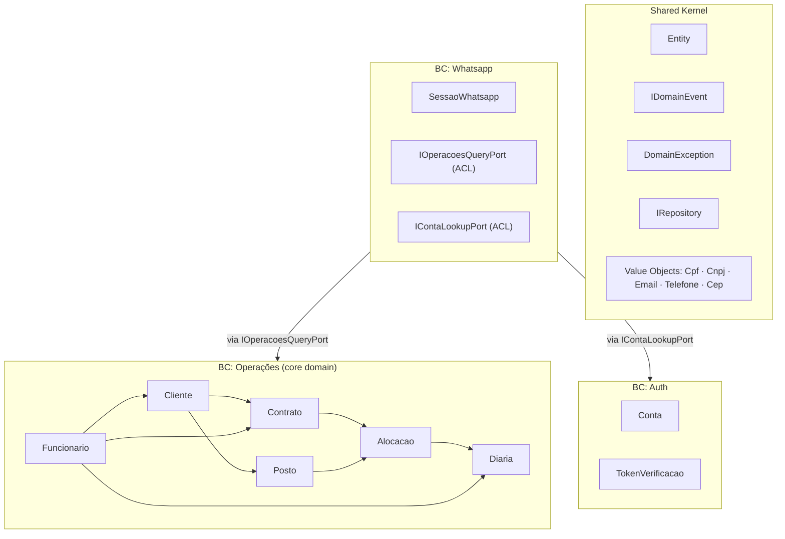

# InterceptorSystem — DDD Refactory: Bounded Contexts, Shared Kernel & Ports/Adapters

Refactoring de alto nível do backend (.NET) organizado em **6 fases** ordenadas por dependência. Fundamentado em DDD real, Pragmatic Programmer e Clean Code.

---

## Diagnóstico: O que está errado hoje

| Problema                                                          | Arquivo                          | Impacto                                                 |
| ----------------------------------------------------------------- | -------------------------------- | ------------------------------------------------------- |
| `[NotMapped]` importado no Domain                                 | `Entity.cs`                      | Infraestrutura vaza no Domain                           |
| `List<object>` para domain events                                 | `Entity.cs`                      | Sem type safety                                         |
| `CheckRule(true, msg)` onde `true` lança                          | `Entity.cs`                      | Semântica invertida e confusa                           |
| FK `"23503"` no Application Layer                                 | `ClienteAppService.cs`           | PostgreSQL error code vaza na App                       |
| `IUnitOfWork` no mesmo arquivo que `IRepository`                  | `IRepository.cs`                 | Má organização                                          |
| Sem Value Objects                                                 | Todo o Domain                    | Strings sem invariantes (Primitive Obsession)           |
| BC único "Administrativo" com 8 agregados                         | Toda a estrutura                 | Sem fronteiras de contexto reais                        |
| Ports sem nomenclatura formal                                     | `Application/Common/Interfaces/` | Sem clareza arquitetural                                |
| Sem `CancellationToken` nos métodos async                         | Repository / AppService          | Operações não canceláveis                               |
| `GetAllAsync()` sem paginação                                     | `IRepository.cs`                 | Carga total em memória                                  |
| `WhatsappBotService` acessa repositórios de Operações diretamente | `WhatsappBotService.cs`          | Viola fronteira de Bounded Context                      |
| `ProcessarConfirmacaoAsync` sem transação                         | `WhatsappBotService.cs`          | Risco de inconsistência (3 writes sem BeginTransaction) |

## O que está bom (manter)

- Rich Domain Model (private setters, métodos comportamentais)
- Global Query Filter para multi-tenancy
- `UnitOfWork` — nunca `SaveChanges` direto
- Decorator pattern (`CachedClienteRepository`)
- Domain Events publicados no `CommitAsync()`
- Testes AAA com xUnit + Moq + WebApplicationFactory
- EF Config separado das entidades (zero Data Annotations no Domain)
- `Conta` excluída do tenant filter (decisão correta)

---

## Context Map — 3 Bounded Contexts



> [!IMPORTANT]
> **Justificativa do BC Operações único:** Todos os agregados de "Administrativo" têm FKs diretos entre si (Funcionario → Cliente + Contrato, Alocacao → Posto + Contrato, Diaria → Funcionario + Alocacao). Separá-los em BCs distintos criaria referências cruzadas entre contextos — violação de DDD. Eles formam um domínio operacional coeso: em empresas de vigilância, cliente, contrato, funcionário e posto são uma unidade indivisível de negócio.

---

## Fase 1 — Shared Kernel + Domain Foundation

**Objetivo:** Remover vazamentos de infra do Domain e dar type safety aos Domain Events.

### [NEW] `IDomainEvent.cs` e `DomainEvent.cs`

```csharp
// Domain/SharedKernel/IDomainEvent.cs
public interface IDomainEvent : INotification
{
    DateTime OccurredOn { get; }
}

// Domain/SharedKernel/DomainEvent.cs
public abstract record DomainEvent : IDomainEvent
{
    public DateTime OccurredOn { get; } = DateTime.UtcNow;
}
```

### [MODIFY] [Entity.cs](file:///home/jpcalsavara/projetos/andamento/InterceptorSystem/backend/src/InterceptorSystem.Domain/Common/Entity.cs)

```diff
-using System.ComponentModel.DataAnnotations.Schema;

 public abstract class Entity
 {
-    private readonly List<object> _domainEvents = new();
+    private readonly List<IDomainEvent> _domainEvents = new();

-    [NotMapped]
-    public IReadOnlyCollection<object> DomainEvents => _domainEvents.AsReadOnly();
+    public IReadOnlyCollection<IDomainEvent> DomainEvents => _domainEvents.AsReadOnly();

-    protected static void CheckRule(bool condition, string errorMessage)
-    {
-        if (condition) throw new InvalidOperationException(errorMessage);
-    }
+    protected static void Enforce(bool isValid, string errorMessage)
+    {
+        if (!isValid) throw new DomainException(errorMessage);
+    }
 }
```

> [!NOTE]
> `[NotMapped]` deve ser configurado no EF via `Ignore()` em `IEntityTypeConfiguration<T>` — não no Domain.
> `Enforce(isValid, msg)` lança quando `isValid == false` — semântica intuitiva vs `CheckRule(condition, msg)` onde `true` lançava.

### [NEW] `DomainException.cs` e `EntityInUseException.cs`

```csharp
// Domain/SharedKernel/Exceptions/DomainException.cs
public class DomainException(string message) : Exception(message);

// Domain/SharedKernel/Exceptions/EntityInUseException.cs
public class EntityInUseException(string entityName)
    : DomainException($"{entityName} não pode ser removido pois está em uso.");
```

### [NEW] `IUnitOfWork.cs` (separado do `IRepository.cs`)

```csharp
// Domain/SharedKernel/Interfaces/IUnitOfWork.cs
public interface IUnitOfWork
{
    Task<bool> CommitAsync(CancellationToken ct = default);
    Task BeginTransactionAsync(CancellationToken ct = default);
    Task CommitTransactionAsync(CancellationToken ct = default);
    Task RollbackTransactionAsync(CancellationToken ct = default);
}
```

### [MODIFY] [IRepository.cs](file:///home/jpcalsavara/projetos/andamento/InterceptorSystem/backend/src/InterceptorSystem.Domain/Common/Interfaces/IRepository.cs)

```diff
 public interface IRepository<T> where T : IAggregateRoot
 {
     IUnitOfWork UnitOfWork { get; }
-    Task<T?> GetByIdAsync(Guid id);
-    Task<IEnumerable<T>> GetAllAsync();
+    Task<T?> GetByIdAsync(Guid id, CancellationToken ct = default);
+    Task<IEnumerable<T>> GetAllAsync(CancellationToken ct = default);
     void Add(T entity);
     void Update(T entity);
     void Remove(T entity);
 }
```

### [MODIFY] 18 Domain Events

Todos os eventos em `Domain/Modulos/*/Events/` devem herdar de `DomainEvent` ao invés de implementar `INotification` diretamente:

```diff
-public record ClienteCreatedEvent(Guid EmpresaId, Guid ClienteId) : INotification;
+public record ClienteCreatedEvent(Guid EmpresaId, Guid ClienteId) : DomainEvent;
```

Arquivos afetados: `ClienteCreated/Updated/DeletedEvent`, `ContratoCreated/Updated/DeletedEvent`, `FuncionarioCreated/Updated/DeletedEvent`, `PostoCreated/Updated/DeletedEvent`, `AlocacaoCreated/Updated/DeletedEvent`, `DiariaCreated/Updated/DeletedEvent`.

---

## Fase 2 — Value Objects

**Objetivo:** Encapsular invariantes de negócio em tipos, eliminar Primitive Obsession.

### Value Objects a criar em `Domain/SharedKernel/ValueObjects/`

| Value Object | Validações                         | Usado em                                            |
| ------------ | ---------------------------------- | --------------------------------------------------- |
| `Cpf`        | 11 dígitos, algoritmo módulo 11    | `Funcionario.Cpf`                                   |
| `Cnpj`       | 14 dígitos, algoritmo módulo 11    | `Cliente.Cnpj`                                      |
| `Email`      | Formato RFC, lowercase normalizado | `Conta.Email`, `Cliente.EmailGestor`                |
| `Telefone`   | 10-11 dígitos, apenas números      | `Funcionario.Celular`, `Cliente.TelefoneEmergencia` |
| `Cep`        | 8 dígitos, apenas números          | `Posto.Cep`                                         |

### Padrão

```csharp
// Domain/SharedKernel/ValueObjects/Cpf.cs
public record Cpf
{
    public string Valor { get; }
    private Cpf(string valor) => Valor = valor;

    public static Cpf Criar(string cpf)
    {
        var digits = cpf.Where(char.IsDigit).ToArray();
        Enforce(digits.Length == 11 && IsValid(digits), "CPF inválido.");
        return new Cpf(new string(digits));
    }

    private static bool IsValid(char[] digits) { /* algoritmo módulo 11 */ }
    public override string ToString() => $"{Valor[..3]}.{Valor[3..6]}.{Valor[6..9]}-{Valor[9..]}";
}
```

### [MODIFY] Entidades para usar VOs

```diff
// Funcionario.cs
-public string Cpf { get; private set; } = null!;
-public string Celular { get; private set; } = null!;
+public Cpf Cpf { get; private set; } = null!;
+public Telefone Celular { get; private set; } = null!;

// Cliente.cs
-public string Cnpj { get; private set; } = null!;
-public string? EmailGestor { get; private set; }
-public string? TelefoneEmergencia { get; private set; }
+public Cnpj Cnpj { get; private set; } = null!;
+public Email? EmailGestor { get; private set; }
+public Telefone? TelefoneEmergencia { get; private set; }

// Posto.cs
-public string Cep { get; private set; } = null!;
+public Cep Cep { get; private set; } = null!;
```

### [MODIFY] EF Configurations — OwnsOne

```csharp
// FuncionarioConfiguration.cs
builder.OwnsOne(f => f.Cpf, cpf =>
    cpf.Property(c => c.Valor).HasColumnName("Cpf").IsRequired().HasMaxLength(11));

builder.OwnsOne(f => f.Celular, tel =>
    tel.Property(t => t.Valor).HasColumnName("Celular").IsRequired().HasMaxLength(11));

// ClienteConfiguration.cs
builder.OwnsOne(c => c.Cnpj, cnpj =>
    cnpj.Property(v => v.Valor).HasColumnName("Cnpj").IsRequired().HasMaxLength(14));

// PostoConfiguration.cs
builder.OwnsOne(p => p.Cep, cep =>
    cep.Property(c => c.Valor).HasColumnName("Cep").IsRequired().HasMaxLength(8));
```

> [!IMPORTANT]
> `HasColumnName` mantém os nomes de coluna iguais ao atual — a migration faz apenas `AlterColumn` (tipo de mapping EF), sem perda de dados nem rename de colunas.

### Migration

```bash
cd backend/src
dotnet ef migrations add Add_ValueObjects \
  --project InterceptorSystem.Infrastructure \
  --startup-project InterceptorSystem.Api
```

---

## Fase 3 — Reorganização de Pastas (Bounded Contexts)

**Objetivo:** Estrutura de pastas reflete os 3 BCs reais do negócio.

### Domain Layer

```
Domain/
  SharedKernel/                        ← era: Common/
    Entity.cs
    IDomainEvent.cs
    DomainEvent.cs
    Interfaces/
      IAggregateRoot.cs
      IRepository.cs
      IUnitOfWork.cs
    Exceptions/
      DomainException.cs
      EntityInUseException.cs
    ValueObjects/
      Cpf.cs · Cnpj.cs · Email.cs · Telefone.cs · Cep.cs

  BoundedContexts/
    Operacoes/                         ← era: Modulos/Administrativo/
      Aggregates/                      ← era: Entidades/
        Cliente.cs · Contrato.cs
        Funcionario.cs · Posto.cs
        Alocacao.cs · Diaria.cs
        Tag.cs · FuncionarioTag.cs · ContratoTag.cs · PostoTag.cs
      Enums/
      Events/
      Interfaces/
        IClienteRepository.cs · IContratoRepository.cs
        IFuncionarioRepository.cs · IPostoRepository.cs
        IAlocacaoRepository.cs · IDiariaRepository.cs · ITagRepository.cs

    Auth/                              ← era: Modulos/Auth/
      Aggregates/
        Conta.cs · TokenVerificacao.cs
      Enums/
      Interfaces/
        IContaRepository.cs · ITokenVerificacaoRepository.cs

    Whatsapp/                          ← era: Modulos/Whatsapp/
      Aggregates/
        SessaoWhatsapp.cs
      Enums/
      Interfaces/
        ISessaoWhatsappRepository.cs
        IOperacoesQueryPort.cs         ← NOVO: ACL Whatsapp → Operações
        IContaLookupPort.cs            ← NOVO: ACL Whatsapp → Auth
```

### Application Layer

```
Application/
  Ports/
    Outbound/                          ← Secondary Ports (sem "Service" no nome)
      IEmailPort.cs                    (era: IEmailService.cs)
      IJwtTokenPort.cs                 (era: IJwtTokenService.cs)
      IPasswordHasherPort.cs           (era: IPasswordHasher.cs)
      IWhatsappNotificationPort.cs     (era: IWhatsappMessageSender.cs)

  BoundedContexts/
    Operacoes/                         ← era: Modulos/Administrativo/
      Commands/
        CreateClienteCommand.cs + CreateClienteCommandHandler.cs
        UpdateClienteCommand.cs + UpdateClienteCommandHandler.cs
        DeleteClienteCommand.cs + DeleteClienteCommandHandler.cs
        (idem para Contrato, Funcionario, Posto, Alocacao, Diaria, Tag)
      Queries/
        GetClienteByIdQuery.cs + GetClienteByIdQueryHandler.cs
        GetAllClientesQuery.cs + GetAllClientesQueryHandler.cs
        (idem para demais agregados)
      DTOs/
      Services/                        ← AppServices como fachadas (não quebram controllers)
    Auth/
    Whatsapp/
      Adapters/
        OperacoesQueryAdapter.cs       ← implementa IOperacoesQueryPort
        ContaLookupAdapter.cs          ← implementa IContaLookupPort
```

### Infrastructure Layer

```
Infrastructure/
  Adapters/                            ← era: Auth/ + Email/ + Whatsapp/
    Auth/
      JwtTokenAdapter.cs               (era: JwtTokenService.cs)
      BCryptPasswordHasherAdapter.cs   (era: BCryptPasswordHasher.cs)
    Email/
      SmtpEmailAdapter.cs              (era: SmtpEmailService.cs)
    Whatsapp/
      MetaWhatsappNotificationAdapter.cs (era: MetaWhatsappMessageSender.cs)
      OperacoesQueryAdapter.cs         ← NOVO
  Caching/                             ← sem alteração
  Persistence/                         ← sem alteração
```

---

## Fase 4 — Fix Violações de Clean Architecture + ACL + CQRS

### 4.1 — Fix FK Violation (Application → Infrastructure)

**Problema:** [ClienteAppService.cs](file:///home/jpcalsavara/projetos/andamento/InterceptorSystem/backend/src/InterceptorSystem.Application/Modulos/Administrativo/Services/ClienteAppService.cs) usa o código PostgreSQL `"23503"` na Application Layer — violação de Clean Architecture.

```diff
-private static bool IsDeleteBlockedByRelationship(Exception exception)
-{
-    var current = exception;
-    while (current != null)
-    {
-        if (current.Message.Contains("23503") || ...) return true;
-        current = current.InnerException;
-    }
-    return false;
-}
```

**Solução:** [ApplicationDbContext.cs](file:///home/jpcalsavara/projetos/andamento/InterceptorSystem/backend/src/InterceptorSystem.Infrastructure/Persistence/Contexts/ApplicationDbContext.cs) captura a exceção e relança como `EntityInUseException`:

```csharp
// Infrastructure/Persistence/Contexts/ApplicationDbContext.cs
public async Task<bool> CommitAsync(CancellationToken ct = default)
{
    try
    {
        // ... bloquear EmpresaId, publicar eventos ...
        return await SaveChangesAsync(ct) > 0;
    }
    catch (DbUpdateException ex) when (IsForeignKeyViolation(ex))
    {
        throw new EntityInUseException("Entidade");
    }
}

private static bool IsForeignKeyViolation(DbUpdateException ex)
{
    var inner = ex.InnerException?.Message ?? string.Empty;
    return inner.Contains("23503") || inner.Contains("FOREIGN KEY");
}
```

A Application Layer captura apenas `EntityInUseException` — sem qualquer referência a código de banco de dados.

### 4.2 — ACL: Whatsapp → Operações

**Problema:** [WhatsappBotService.cs](file:///home/jpcalsavara/projetos/andamento/InterceptorSystem/backend/src/InterceptorSystem.Application/Modulos/Whatsapp/Services/WhatsappBotService.cs) injeta `IClienteRepository`, `IPostoRepository` e `IDiariaAppService` diretamente — cruza fronteira de Bounded Context.

**Solução:** `IOperacoesQueryPort` no BC Whatsapp define o contrato mínimo que o bot precisa:

```csharp
// Domain/BoundedContexts/Whatsapp/Interfaces/IOperacoesQueryPort.cs
public interface IOperacoesQueryPort
{
    Task<IEnumerable<ClienteResumo>> GetClientesAtivosAsync(CancellationToken ct = default);
    Task<IEnumerable<PostoResumo>> GetPostosByClienteAsync(Guid clienteId, CancellationToken ct = default);
    Task<DiariaResumo?> GetDiariaByPostoEDataAsync(Guid postoId, DateOnly data, CancellationToken ct = default);
    Task RegistrarSubstituicaoAsync(RegistrarSubstituicaoDto dto, CancellationToken ct = default);
}
```

`OperacoesQueryAdapter` (Infrastructure) implementa a porta delegando para os repositórios reais. `WhatsappBotService` passa a receber apenas `IOperacoesQueryPort` — sem conhecimento de repositórios do BC Operações.

### 4.3 — Fix Transação em `ProcessarConfirmacaoAsync`

**Problema:** O método realiza 3 writes em agregados diferentes sem `BeginTransactionAsync` — risco de inconsistência caso qualquer passo falhe.

```diff
 public async Task ProcessarConfirmacaoAsync(...)
 {
+    await _sessoes.UnitOfWork.BeginTransactionAsync(ct);
+    try
+    {
         await _operacoes.CancelarDiariaAsync(diariaIdParaSubstituir, ct);
         await _operacoes.RegistrarSubstituicaoAsync(novaSubstituicao, ct);
         _sessoes.Remove(sessao);
         await _sessoes.UnitOfWork.CommitAsync(ct);
+        await _sessoes.UnitOfWork.CommitTransactionAsync(ct);
+    }
+    catch
+    {
+        await _sessoes.UnitOfWork.RollbackTransactionAsync(ct);
+        throw;
+    }
 }
```

### 4.4 — CQRS Gradual (AppServices como fachadas)

Controllers não mudam. AppServices passam a delegar para MediatR handlers, separando responsabilidade de escrita (Command) e leitura (Query):

```csharp
// Application/BoundedContexts/Operacoes/Services/ClienteAppService.cs
public class ClienteAppService(ISender sender) : IClienteAppService
{
    public Task<ClienteDtoOutput> CreateAsync(CreateClienteDtoInput input, CancellationToken ct = default)
        => sender.Send(new CreateClienteCommand(input), ct);

    public Task<ClienteDtoOutput?> GetByIdAsync(Guid id, CancellationToken ct = default)
        => sender.Send(new GetClienteByIdQuery(id), ct);
}

// Application/BoundedContexts/Operacoes/Commands/CreateClienteCommandHandler.cs
public class CreateClienteCommandHandler(IClienteRepository repo, ICurrentTenantService tenant)
    : IRequestHandler<CreateClienteCommand, ClienteDtoOutput>
{
    public async Task<ClienteDtoOutput> Handle(CreateClienteCommand cmd, CancellationToken ct)
    {
        var empresaId = tenant.EmpresaId ?? throw new DomainException("Tenant não identificado.");
        var cliente = new Cliente(empresaId, cmd.Input.Nome, cmd.Input.Cnpj, ...);
        repo.Add(cliente);
        await repo.UnitOfWork.CommitAsync(ct);
        return ClienteDtoOutput.FromEntity(cliente)!;
    }
}
```

---

## Fase 5 — Paginação nos Repositories

**Objetivo:** Eliminar `GetAll` que carrega tudo em memória.

```csharp
// Domain/SharedKernel/IPagedResult.cs
public interface IPagedResult<T>
{
    IReadOnlyList<T> Items { get; }
    int TotalCount { get; }
    int Page { get; }
    int PageSize { get; }
    int TotalPages { get; }
}

// Adição em IRepository<T>
Task<IPagedResult<T>> GetPagedAsync(int page, int pageSize, CancellationToken ct = default);
```

---

## Fase 6 — Atualização das Skills

### [MODIFY] [code-review/SKILL.md](file:///home/jpcalsavara/projetos/andamento/InterceptorSystem/.agents/skills/code-review/SKILL.md)

Adicionar ao checklist de Backend / C#:

- [ ] Serviços não cruzam fronteiras de Bounded Context (BC Operações, Auth, Whatsapp)
- [ ] Value Objects para CPF, CNPJ, Email, CEP, Telefone — nunca `string` cru com semântica de negócio
- [ ] Ports externos nomeados como `I*Port` em `Application/Ports/Outbound/`
- [ ] Commands para writes, Queries para reads — nunca misturar no mesmo handler
- [ ] `CancellationToken ct = default` em todos os métodos async públicos
- [ ] `DomainException` nas entidades, nunca `InvalidOperationException`
- [ ] `Enforce(isValid, msg)` — não `CheckRule(condition, msg)`

### [MODIFY] [create-endpoint/SKILL.md](file:///home/jpcalsavara/projetos/andamento/InterceptorSystem/.agents/skills/create-endpoint/SKILL.md)

Fluxo CQRS (substituir "AppService" como orquestrador direto):

1. **Domain:** garantir que o agregado tem o método comportamental
2. **Command + CommandHandler** para writes / **Query + QueryHandler** para reads
3. **AppService fachada** delega via `ISender.Send(new Command(...), ct)`
4. Se serviço externo envolvido: definir `I*Port` em `Application/Ports/Outbound/`
5. Verificar se VO já existe antes de usar `string` para CPF/CNPJ/Email/CEP/Telefone

### [MODIFY] [generate-tests/SKILL.md](file:///home/jpcalsavara/projetos/andamento/InterceptorSystem/.agents/skills/generate-tests/SKILL.md)

Casos de teste obrigatórios adicionais:

- **Value Object inválido** deve lançar `DomainException` (ex: CPF com 10 dígitos)
- **Método comportamental** do agregado deve registrar o Domain Event correspondente (`entity.DomainEvents.Should().ContainSingle(...)`)
- **CommandHandler:** testar bom caso, entidade não encontrada, valor inválido (DomainException)
- Passar `CancellationToken.None` explicitamente nos mocks async

### [MODIFY] [ef-migration/SKILL.md](file:///home/jpcalsavara/projetos/andamento/InterceptorSystem/.agents/skills/ef-migration/SKILL.md)

Regras adicionais:

- Value Objects mapeados com `OwnsOne` — usar `HasColumnName("NomeOriginal")` para preservar coluna existente
- Convenção de nome de migration: `Add_<VO>_To_<Tabela>` (ex: `Add_ValueObjects_To_Funcionarios`)
- Após reorganização de namespaces: verificar que nenhuma migration de rename de tabela foi gerada (não deve ocorrer — mapeamento por `ToTable()` não muda)

---

## Verificação por Fase

```bash
# Após cada fase:
cd backend/src
dotnet build InterceptorSystem.sln
dotnet test InterceptorSystem.Tests/InterceptorSystem.Tests.csproj --verbosity normal
# Todos os 167+ testes devem passar

# Fase 2 apenas — gera migration mas não altera nomes de coluna:
dotnet ef migrations add Add_ValueObjects \
  --project InterceptorSystem.Infrastructure \
  --startup-project InterceptorSystem.Api
dotnet ef database update \
  --startup-project InterceptorSystem.Api

# Fases 1, 3, 4, 5: nenhuma migration nova esperada
dotnet ef migrations list \
  --startup-project InterceptorSystem.Api
# Contagem não deve crescer
```
